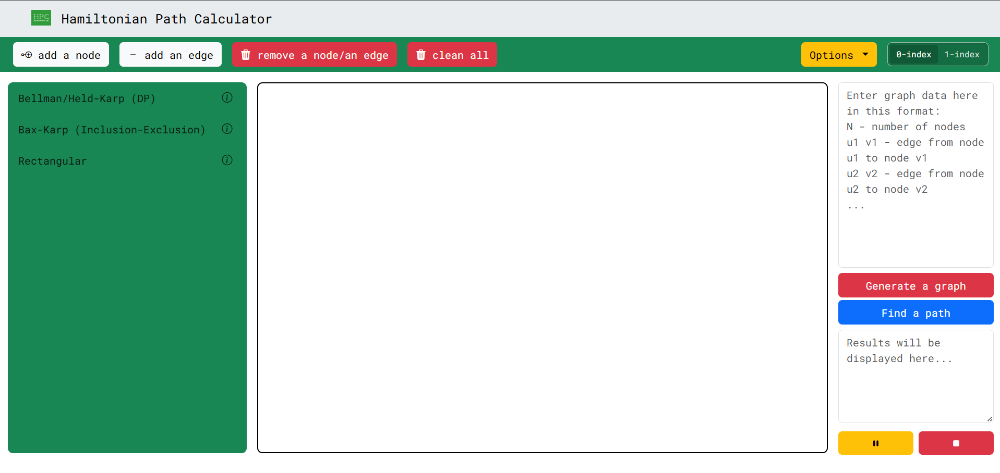
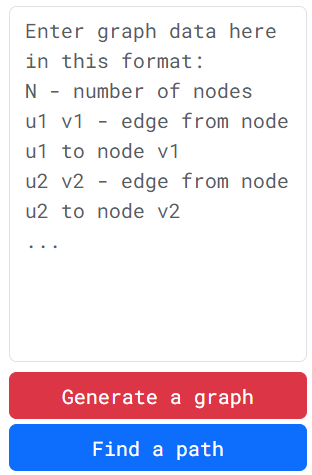
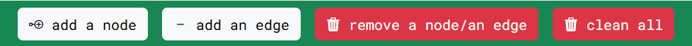
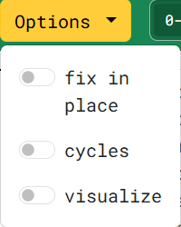

# HamPathCalc

Interactive web application for finding Hamiltonian paths and Hamiltonian cycles in undirected graphs. HamPathCalc provides a visual graph editor, several algorithm implementations, optional step-by-step visualization, and a text-based graph input format.

The application runs the Python algorithms directly in the browser with [Pyodide](https://pyodide.org/), so a separate Python server is not required for normal website use.




## Table of Contents

- [HamPathCalc](#hampathcalc)
  - [Table of Contents](#table-of-contents)
  - [Features](#features)
  - [Algorithms](#algorithms)
    - [Bellman/Held-Karp](#bellmanheld-karp)
    - [Bax-Karp](#bax-karp)
    - [Rectangular](#rectangular)
  - [How to Use the Website](#how-to-use-the-website)
    - [1. Create or enter a graph](#1-create-or-enter-a-graph)
    - [2. Choose indexing](#2-choose-indexing)
    - [3. Choose a solver](#3-choose-a-solver)
    - [4. Manage the options](#4-manage-the-options)
    - [5. Calculate the result](#5-calculate-the-result)
  - [Graph Input Format](#graph-input-format)
  - [Local Setup](#local-setup)
    - [Prerequisites](#prerequisites)
    - [Installation](#installation)
    - [Run locally during development](#run-locally-during-development)
  - [Building the Website](#building-the-website)
  - [Project Structure](#project-structure)
  - [Technical Notes](#technical-notes)

## Features

- Create graphs visually by adding nodes and edges.
- Enter or edit a graph using a text representation.
- Generate the visual graph from the text input.
- Find Hamiltonian paths or Hamiltonian cycles.
- Choose between zero-based and one-based node indexing.
- Select the most suitable algorithm for the graph.
- Visualize supported algorithm steps and pause or stop the visualization.
- Move nodes, remove individual items, or clear the entire graph.
- View algorithm descriptions, recurrence relations, and complexity information in the interface.

## Algorithms

### Bellman/Held-Karp

The Bellman/Held-Karp solver uses bottom-up dynamic programming over subsets of vertices. It is intended for general graphs and returns a Hamiltonian path when one exists.

- Time complexity: $O(n^2 2^n)$
- Space complexity: $O(n 2^n)$

### Bax-Karp

The Bax-Karp solver uses the inclusion-exclusion principle and matrix exponentiation. For paths it reports the number of Hamiltonian paths; for cycles it reports the number of Hamiltonian cycles.

- Time complexity: $O(n^3 \log n \cdot 2^n)$
- Space complexity: $O(n^2)$

### Rectangular

The Rectangular solver is specialized for rectangular grid graphs. It uses a recursive divide-and-conquer strategy and requires a start and an end node to be selected in the graph editor. This solver currently supports Hamiltonian paths only.

- Time complexity: $O(mn)$
- Space complexity: $O(mn)$

## How to Use the Website

### 1. Create or enter a graph

Use the text area on the right side of the application. The first line contains the number of nodes. Each following line contains one undirected edge.



Example:

```text
5
0 1
1 2
2 3
3 4
```

Click **Generate a graph** to display the graph. The nodes are placed automatically. Enable **fix in place** before generating again if existing node positions should be preserved.

You can also create a graph manually:

1. Click **add a node** and click in the graph area.
2. Click **add an edge**, then click the two nodes to connect.
3. Use **remove a node/an edge** to delete an item.
4. Use **clean all** to remove the current graph.



### 2. Choose indexing

The application supports both:

- **0-index**: nodes are numbered from `0` to `N - 1`.
- **1-index**: nodes are numbered from `1` to `N` in the input and display.

Graph indexing can be changed at any moment.

### 3. Choose a solver

Select one of the solver entries on the left:

- **Bellman/Held-Karp (DP)** for general Hamiltonian path searches.
- **Bax-Karp (Inclusion-Exclusion)** for counting paths or cycles.
- **Rectangular** for rectangular grid graphs.

When using **Rectangular**, click the desired start node and end node after selecting the solver.

If no method is chosen, the program uses the default method (currently **Bax-Karp**)

### 4. Manage the options

Currently, three options are available under the options menu:

- *fix in place* which fixes the graph in place (i.e. it is not moved when generated again).
- *cycles* which counts cycles instead of paths.
- *visualize* which displays how an algorithm calculates a path, if available for a given algorithm. **(Currently supported for Bellman/Held-Karp algorithm only)**



### 5. Calculate the result

After you have chosen your preferred options, click **Find a path**. The result panel displays the selected method, cycle setting, and either the path or the number of paths/cycles.

For a path returned by a constructive solver, the solution edges are highlighted in red.

## Graph Input Format

For standard path and cycle calculations, use:

```text
N
u1 v1
u2 v2
...
```

Where:

- `N` is the number of nodes.
- Each `u v` pair describes an undirected edge.
- Node identifiers must match the selected indexing mode.
- Self-loops are not allowed.
- The graph may contain isolated nodes, although a Hamiltonian path will usually not exist in that case.

The website adds the cycle option internally when **Find a path** is clicked. **Do not add `true` or `false` to the text area yourself.**

## Local Setup

### Prerequisites

- Node.js 18 or newer.
- npm.
- A modern browser with JavaScript enabled.
- Internet access on the first calculation, because Pyodide, MathJax, Bootstrap, and Bootstrap Icons are loaded from the web.

Python is included in the browser runtime through Pyodide and is not required as a local dependency for the website.

### Installation

Clone the repository and install the npm dependencies:

```bash
git clone https://github.com/HamPathCalc/HamPathCalc.github.io.git
cd HamPathCalc
npm install
```

### Run locally during development

Serve the repository through a local HTTP server. Serving the files is important because the application fetches Python source files at runtime.

Using Python's built-in server:

```bash
python -m http.server 8000
```

Open [http://localhost:8000](http://localhost:8000) in a browser.

Alternatively, use any static file server such as `npx serve .`.

## Building the Website

Create a production-ready static directory with:

```bash
npm run build
```

The build script removes and recreates `dist/`, then copies the website files, algorithms, Python entry point, and local Bootstrap assets into it.

Serve the generated directory with:

```bash
python -m http.server 8000 --directory dist
```

Then open [http://localhost:8000](http://localhost:8000).

## Project Structure

```text
.
├── algorithms/
│   ├── bax_karp.py              # Bax-Karp solver
│   ├── held_karp.py             # Bellman/Held-Karp solver
│   ├── rectangular.py           # Rectangular-grid solver
│   └── classes/                 # Graph and solver support classes
├── img/                         # Images and application logo
├── src/
│   ├── script.js                # Graph editor and Pyodide integration
│   └── style.css                # Application styles
├── build.mjs                    # Static build script
├── index.html                   # Main website page
├── main.py                      # Python entry point and input validation
├── package.json                 # npm scripts and dependencies
└── dist/                        # Generated build output
```

## Technical Notes

- The graph is represented as an undirected adjacency matrix.
- Python source files are fetched by the browser and loaded into Pyodide when the first calculation is started.
- The first calculation can take longer because the Pyodide runtime must initialize.
- Exponential algorithms become expensive as the number of nodes increases. For larger rectangular grid graphs, prefer the Rectangular solver.
- The current web interface does not require a backend server.